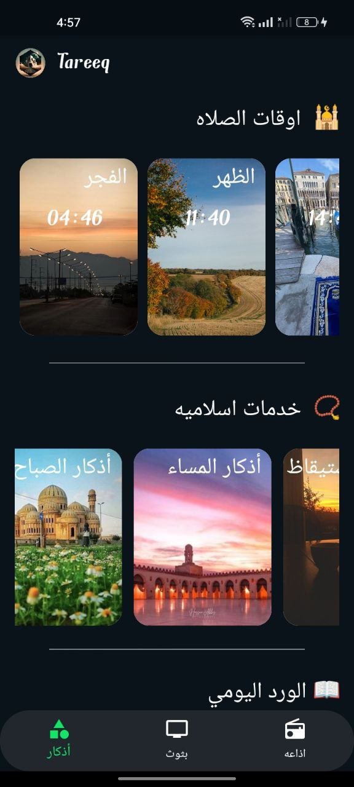
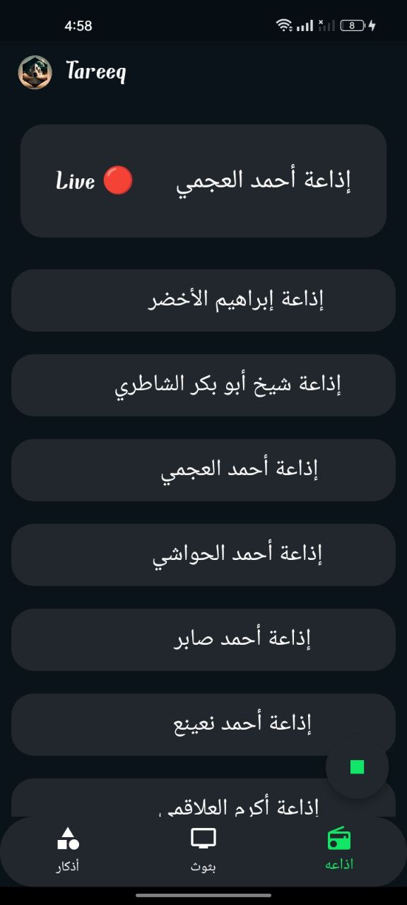
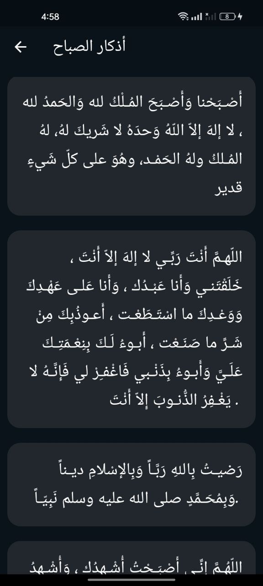

# Tareeq - Your Islamic Companion

Tareeq is an Islamic app designed to provide a comprehensive set of features to support the spiritual journey of Muslims. Developed using Flutter, Tareeq offers a seamless and user-friendly experience. With Tareeq, you can easily access prayer times, Azkar (dua'aa), random Quranic Ayah, live streams from Makkah and Madina, and a radio for Quran reciters.

## Features:

### 1. Prayer Times
Tareeq provides accurate prayer times for Muslims, so you never miss your daily Salah. The app offers prayer times for Fajr, Dhuhr, Asr, Maghrib, and Isha, based on your current location. You can also customize the calculation method to match your preferences.

### 2. Azkar (Dua'aa)
Access a collection of Azkar and dua'aa to enhance your spiritual practice. Tareeq offers a wide range of supplications for various occasions and situations in your life.

### 3. Random Ayah
Receive daily inspiration by accessing a random Quranic Ayah. Let the wisdom of the Quran guide you throughout your day.

### 4. Live Streams from Makkah and Madina
Experience the spiritual essence of Islam by watching live streams from Makkah and Madina. Join in the beauty of these sacred cities from the comfort of your home.

### 5. Quran Reciters Radio
Tareeq provides a radio feature that allows you to listen to the recitation of the Quran by different Qaris (reciters). Immerse yourself in the melodious recitation of the Holy Quran.

## Installation

To get started with Tareeq, follow these steps:

1. Download the app from the [WebSite](https://tareeq.netlify.app/).
2. Open the app and grant location access to ensure accurate prayer times.
3. Explore the various features and enhance your Islamic journey with Tareeq.

## Screenshots

Here are some screenshots from the Tareeq app:

  <h2>Mobile App Screenshots</h2>

  
  
  

  
  
  

## Support

If you need assistance or have any questions, please feel free to contact our support team at [apptareeq@gmail.com](apptareeq@gmail.com).

`  We hope Tareeq enriches your spiritual experience and supports your daily Islamic practices. May your journey be blessed and guided by the app's features. `

